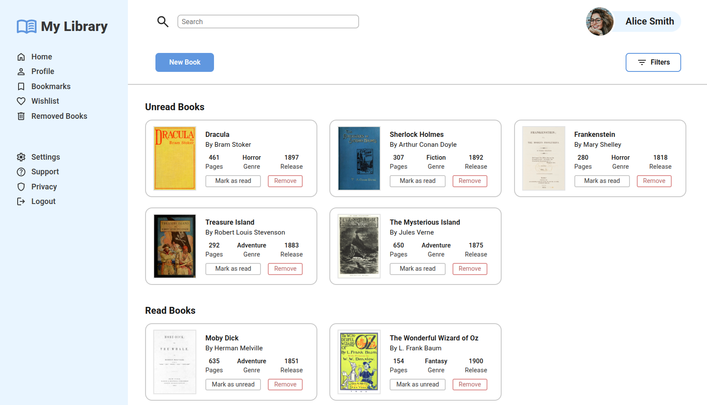
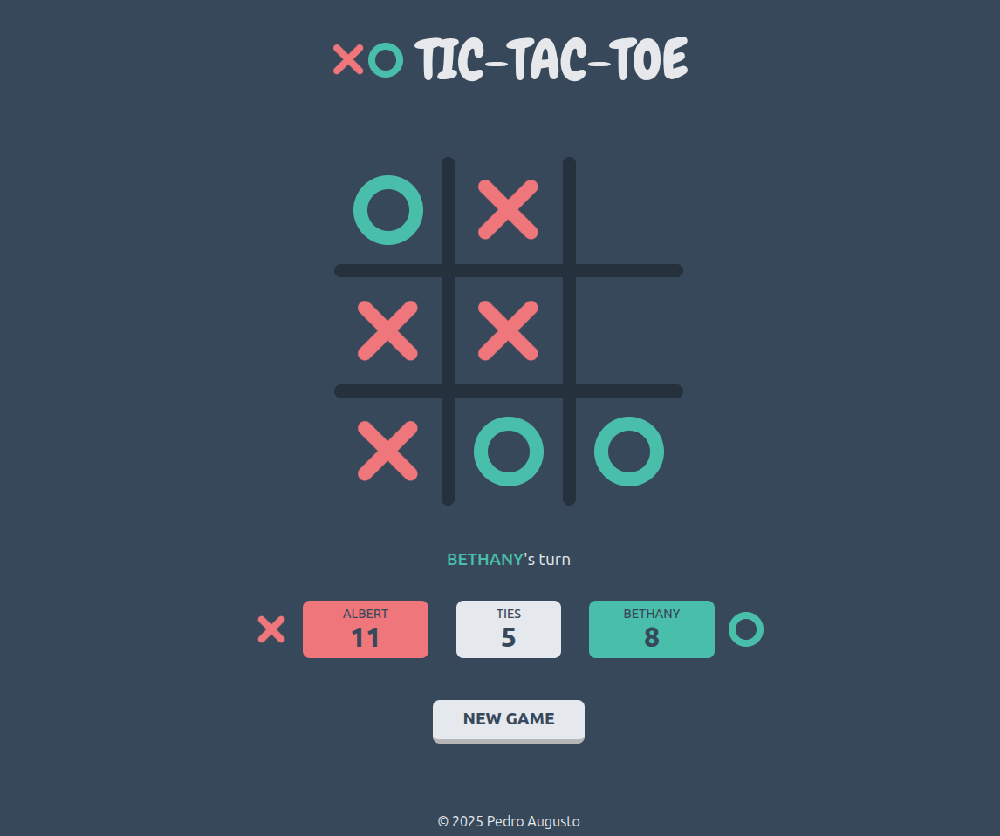
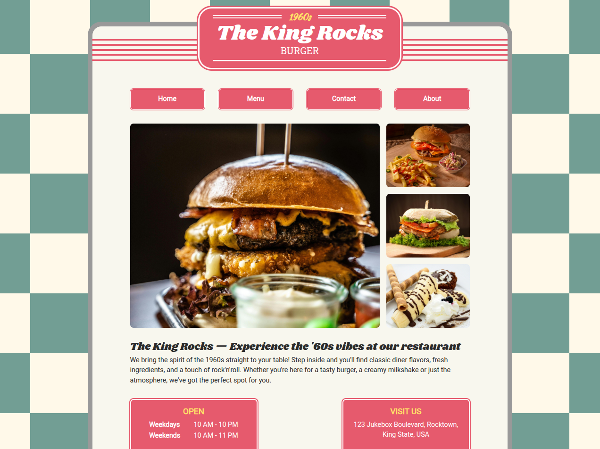
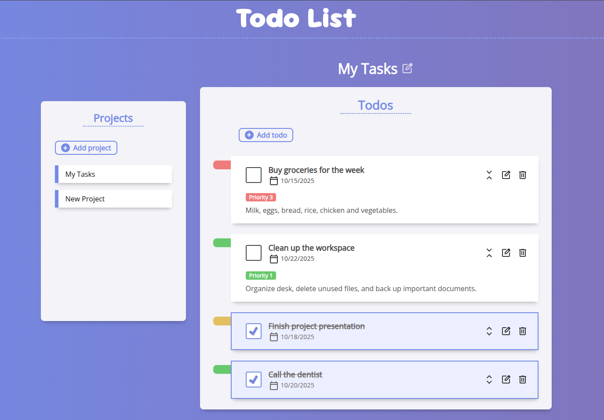

# JavaScript

## Overview

These are my projects from JavaScript course. _(in progress)_

| 📝 **Project**      | 📕 **Description**                                                                       | ⚙️ **Features**                             | 📁 **Repository**                                              |
| :------------------ | :--------------------------------------------------------------------------------------- | :------------------------------------------ | :------------------------------------------------------------- |
| **Library**         | A library app interface that displays books within cards, which can be added via a form. | HTML, CSS, JavaScript, Object Constructors  | [library](https://github.com/PedroASB/library)                 |
| **Tic-Tac-Toe**     | A classic Tic-Tac-Toe game for browser.                                                  | HTML, CSS, JavaScript, Factory Functions    | [tic-tac-toe](https://github.com/PedroASB/tic-tac-toe)         |
| **Restaurant Page** | A web page for a fictional restaurant.                                                   | HTML, CSS, JavaScript, ES6 Modules, Webpack | [restaurant-page](https://github.com/PedroASB/restaurant-page) |
| **Todo List**       | A to-do list application that lets users create and manage tasks and projects.           | HTML, CSS, JavaScript, Local Storage        | [todo-list](https://github.com/PedroASB/todo-list)             |
| **Weather App**     | A weather forecast website using the Visual Crossing API.                                | HTML, CSS, JavaScript, Async/Await, APIs    | [weather-app](https://github.com/PedroASB/weather-app)         |
| **DSA JavaScript**  | Data structures and algorithms in JavaScript.                                            | JavaScript, Data Structures, Algorithms     | [dsa-javascript](https://github.com/PedroASB/dsa-javascript)   |
| **Jest Practice**   | Some JavaScript functions tests using Jest framework.                                    | HTML, CSS, JavaScript, Async/Await, APIs    | [jest-practice](https://github.com/PedroASB/jest-practice)     |

 

# Project Previews

## Library

---

 

## Tic-Tac-Toe

---

 

## Restaurant Page

---

 

## Todo List

---

 

## Weather App

